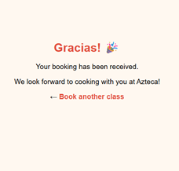
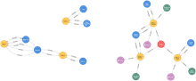

# Azteca Cooking Experience 🌶️

[](https://azteca-hugocamachoromero1.pythonanywhere.com/booking_form)
[](https://flask.palletsprojects.com/)
[](https://www.mysql.com/)
[](https://neo4j.com/)

> 🍽️ Book authentic Mexican cooking classes & experience cultural storytelling through food.

---

## 🌟 About the Project

Welcome to the **Azteca Cooking Experience** – a cultural, culinary, and digital storytelling project.  
After 22 years running **AZTECA** (restaurant + school) in Dublin, Ireland, this platform continues my mission:  
to teach, celebrate, and share **authentic Mexican cuisine** online.

My logo is proudly inspired by the **Aztec calendar**, symbolising deep cultural roots and the timeless joy of food.

---

## 🎯 Features

- ✅ Online booking form with input validation  
- ✅ MySQL backend hosted on PythonAnywhere  
- ✅ Auto-confirmation + thank-you page  
- ✅ Flask-powered RESTful API  
- ✅ Live Neo4j integration for student-class relationships  
- ✅ Clean Bootstrap-ready UI  
- ✅ Portable and educational codebase

---

## 🚀 Live Demo

🔗 [**Book a class**](https://azteca-hugocamachoromero1.pythonanywhere.com/booking_form)  
🎉 After submitting, you’ll be redirected to a friendly thank-you page.

---

## 🖼️ Screenshots

| Booking Form | Thank-You Page |
| ------------ | -------------- |
|  |  |

---

## 🧠 Graph Insights (Neo4j)

Explore live data from your class bookings visualised as a graph.

| Bookings Overview | All Relationships |
|-------------------|-------------------|
|  |  |

---

## 🧩 Cypher Query Examples

```cypher
// All student bookings
MATCH (s:Student)-[r:BOOKED]->(c:Class)
RETURN s, r, c

// All relationships in the graph
MATCH p=()-->() RETURN p LIMIT 25
```

---

## 🗂️ Folder Structure

```bash
azteca-cooking-experience/
│
├── azteca_api_app.py            # Flask backend logic
├── sync_mysql_to_neo4j.py       # Python sync script for Neo4j
├── test_neo4j_connection.py     # Simple Neo4j connection test
├── templates/                   # HTML templates
├── assets/images/               # Screenshots and visuals
├── recipes/                     # Authentic recipes
├── class-outlines/              # Lesson plans
├── website-ideas/               # Drafts for future WordPress site
├── aztkcooking.ipynb            # Jupyter research and notes
├── requirements.txt             # Python dependencies
└── README.md                    # This file
```

---

## 🧪 How to Run Locally

```bash
git clone https://github.com/hugcamrom/azteca-cooking-experience.git
cd azteca-cooking-experience
python -m venv venv
source venv/bin/activate       # Windows: venv\Scripts\activate
pip install -r requirements.txt
touch .env                     # Add your DB & Neo4j credentials
python azteca_api_app.py
```

Then open [http://127.0.0.1:5000/booking_form](http://127.0.0.1:5000/booking_form)

---
📚 Sources & References
Flask Documentation – https://flask.palletsprojects.com
For building and deploying RESTful APIs in Python.

MySQL Docs – https://dev.mysql.com/doc/
For database setup and query standards.

Neo4j Cypher Manual – https://neo4j.com/docs/cypher-manual/current/
Reference for writing and optimising graph queries.

PythonAnywhere Help – https://help.pythonanywhere.com/
Used for deployment, web app configuration, and bash scripting.

Bootstrap – https://getbootstrap.com
Optional CSS framework for responsive UI enhancements.

Shields.io – https://shields.io
Used to generate the README badges.

Aztec Calendar Symbolism – https://en.wikipedia.org/wiki/Aztec_calendar
Inspiration behind the project’s logo and cultural aesthetic.

GitHub Copilot – Assisted with autocompletion and code suggestions throughout development.

ChatGPT – Used for academic purposes during the learning process to plan, debug, document, and structure the project.

---

## 💬 Contact

📧 [aztecainfo@azteca.ie](mailto:aztecainfo@azteca.ie)  
🌐 [https://azteca.ie](https://azteca.ie)

---

## 🧡 Acknowledgements

To my amazing students, guests, and supporters — thank you for making Azteca unforgettable.  
This project is for you.  
**Azteca – to enjoy life!**
